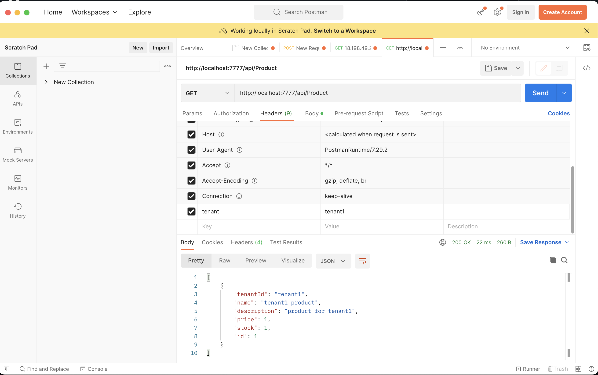

# database-per-tenant
This repository is created with the sole purpose of learning Multi Tenancy: Database Per Tenant approach.

## Description
This project simulates a web api that has 3 tenants. Each tenant has its own database. The web api is a simple CRUD for a product entity. The web api is implemented with .NET Core 5.

You can clone this project and use docker to try it. To run with docker:
> docker-compose up -d

This will create 4 mysql containers and the web api. Web api will run at port 7777. MySql containers are named:  
<ul>
  <li>tenantdb - default</li>
  <li>tenant1db - for tenant1</li>
  <li>tenant2db - for tenant2</li>
  <li>tenant3db - for tenant3</li>
</ul>

For learning purposes there are 3 tenants and requests should be made with tenant header.
Example request:

Tenant IDs:
<ul>
  <li>tenant1</li>
  <li>tenant2</li>
  <li>tenant3</li>
</ul>
